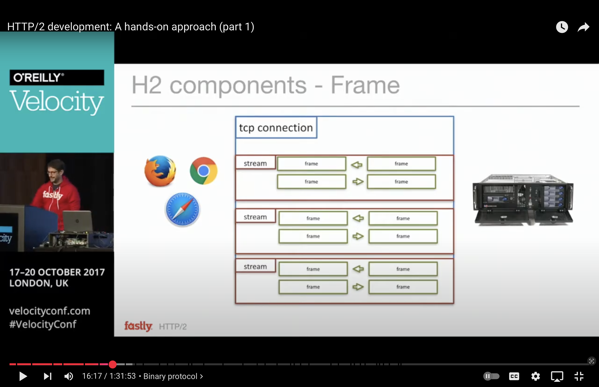

The HTTP Archive Tracks How the Web is Built.
https://httparchive.org
https://almanac.httparchive.org/en/2024/table-of-contents

## HTTP 2

HTTP/2 Implementation Debug State
draft-benfield-http2-debug-state-01
https://datatracker.ietf.org/doc/html/draft-benfield-http2-debug-state-01


https://github.com/nghttp2/nghttp2


### HTTP/2 development: A hands-on approach (part 1)

https://www.youtube.com/watch?v=-KLGzMQj7EE



Connecting through HTTP 2 using openssl:

```
(printf "PRI * HTTP/2.0\r\n\r\nSM\r\n\r\n";sleep 1) | \
    openssl s_client -alpn h2 -servername www.fastly.com \
    -connect www.fastly.com:443

Connecting to 2a04:4e42:3b::313
CONNECTED(00000005)
depth=2 C=US, ST=Arizona, L=Scottsdale, O=Starfield Technologies, Inc., CN=Starfield Root Certificate Authority - G2
verify return:1
depth=1 C=US, O=Certainly, CN=Certainly Intermediate R1
verify return:1
depth=0 CN=www.fastly.com
verify return:1
---
Certificate chain
 0 s:CN=www.fastly.com
   i:C=US, O=Certainly, CN=Certainly Intermediate R1
   a:PKEY: rsaEncryption, 2048 (bit); sigalg: RSA-SHA256
   v:NotBefore: Feb 11 19:21:45 2025 GMT; NotAfter: Mar 13 19:21:44 2025 GMT
 1 s:C=US, O=Certainly, CN=Certainly Intermediate R1
   i:C=US, ST=Arizona, L=Scottsdale, O=Starfield Technologies, Inc., CN=Starfield Root Certificate Authority - G2
   a:PKEY: rsaEncryption, 2048 (bit); sigalg: RSA-SHA256
   v:NotBefore: Jun 22 00:00:00 2022 GMT; NotAfter: Jun 21 23:59:59 2032 GMT
---
Server certificate
-----BEGIN CERTIFICATE-----
MIIFMDCCBBigAwIBAgISdqRZPRu3vf1B4F4TdyueD6mWMA0GCSqGSIb3DQEBCwUA
...
KoArXQBQzSZoUxh1Vvr5tjfOCu1rNvdw5hu3AyNr1lH0S5b8
-----END CERTIFICATE-----
subject=CN=www.fastly.com
issuer=C=US, O=Certainly, CN=Certainly Intermediate R1
---
No client certificate CA names sent
Peer signing digest: SHA256
Peer signature type: RSA-PSS
Server Temp Key: X25519, 253 bits
---
SSL handshake has read 3078 bytes and written 398 bytes
Verification: OK
---
New, TLSv1.3, Cipher is TLS_AES_128_GCM_SHA256
Protocol: TLSv1.3
Server public key is 2048 bit
This TLS version forbids renegotiation.
Compression: NONE
Expansion: NONE
ALPN protocol: h2
Early data was not sent
Verify return code: 0 (ok)
---
---
Post-Handshake New Session Ticket arrived:
SSL-Session:
    Protocol  : TLSv1.3
    Cipher    : TLS_AES_128_GCM_SHA256
    Session-ID: 23BA3734246D46E4CA21CB89B385AE874965BCDC4B97951D14DAE52F6F1E1966
    Session-ID-ctx: 
    Resumption PSK: 3B232AA08EBCC2F7FF48187043057CF0FA8A36717FF5F2781B950CE8241A1A54
    PSK identity: None
    PSK identity hint: None
    SRP username: None
    TLS session ticket lifetime hint: 86400 (seconds)
    TLS session ticket:
    0000 - f0 c8 7a 61 51 0a 56 70-5b 1f 6e 30 9c 51 6e 18   ..zaQ.Vp[.n0.Qn.
    0010 - db 18 b4 17 c0 f8 40 b8-a6 95 f2 57 d7 da 7b 89   ......@....W..{.
    0020 - 2f f7 7f 1d c7 c2 91 4b-6b a4 9d 6d 61 58 25 cc   /......Kk..maX%.
    0030 - 9d 76 b4 9b 0c 39 12 a4-7f b0 58 57 96 1c 76 d7   .v...9....XW..v.
    0040 - 6b 07 f0 22 fa 01 11 15-e2 0f 15 d9 0d b9 f1 d3   k.."............
    0050 - d7 91 f9 0e 03 2c 65 db-96 ae 18 40 a6 a4 5e 30   .....,e....@..^0
    0060 - 31 e6 b9 9a 3c 00 fe b1-dd ca 10 12 dd b3 95 51   1...<..........Q
    0070 - 6f 2f fe 1d 7f c1 97 49-17 b9 d7 af f9 4b d1 26   o/.....I.....K.&
    0080 - 87 47 8a a0 56 79 8e 00-7b 01 01 5c de f5 ef 57   .G..Vy..{..\...W
    0090 - 21 cb d1 8c f8 72 d0 a2-22 07 06 04 d3 5b 4f 0e   !....r.."....[O.
    00a0 - 6c 70 c0 13 26 32 0a f3-b3 23 64 02 64 c8 6e ae   lp..&2...#d.d.n.

    Start Time: 1739736397
    Timeout   : 7200 (sec)
    Verify return code: 0 (ok)
    Extended master secret: no
    Max Early Data: 8192
---
read R BLOCK

dH?DONE
```

hexdump:

```
(printf "PRI * HTTP/2.0\r\n\r\nSM\r\n\r\n";sleep 1) | \
    openssl s_client -alpn h2 -servername www.fastly.com \
    -connect www.fastly.com:443 2> /dev/null | hexdump -C

```
